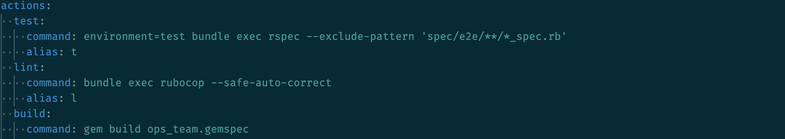
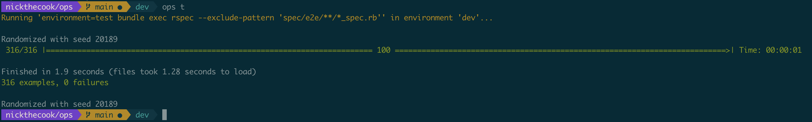
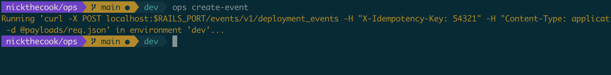
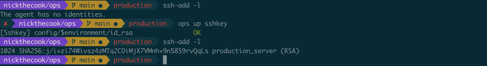
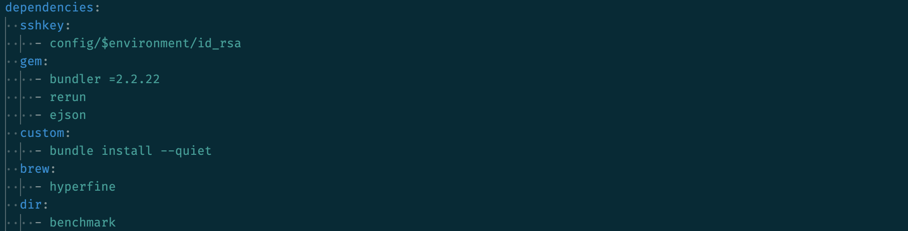
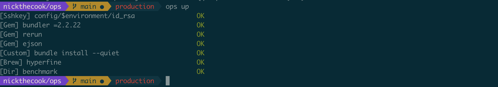
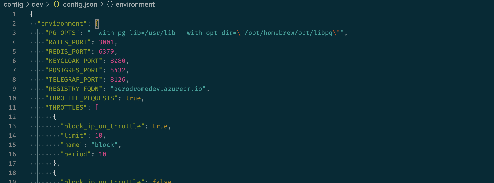
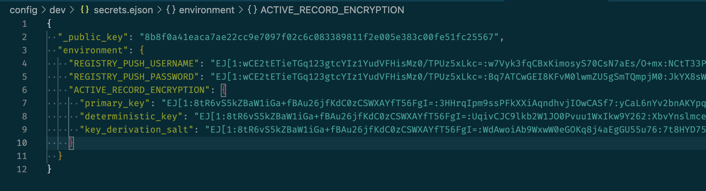

# Crystal Ops (crops)

> This is a port of [`ops`](https://github.com/nickthecook/ops) to Crystal. Versions start at 2.0.0, and the executable is still `ops`. `ops` is still available via `gem` as [`ops_team`](https://rubygems.org/gems/ops_team). See bottom of file for differences between `crops` and `ops`.

> The code in this repo is currently hot garbage, due mostly to having been ported from Ruby without significant refactoring. The refactor is a work in progress. However, the tool works.

[View on RubyGems.org](https://rubygems.org/gems/ops_team)

## Overview

`ops` lets you add shell commands to `ops.yml` and run them via shortcuts when you're in that directory. `ops.yml` becomes a context-aware place to add common commands.

The commands you run to work with your project become discoverable to other devs. You can have different commands in different directories, because `ops` always looks for `ops.yml` in your current working directory.

New devs don't need to find which Rakefile contains the task that failed. Just run `ops help`.

You no longer have to write a shell script for that `curl` command that hits your API in dev, just run `ops create-event`.

`ops` will encrypt your SSH keys using a passphrase from an EJSON file, and never prompt you for the passphrase:

## Dependencies

You can record dependencies for your project in `ops.yml`:

and `ops up` will satisfy them for you.

The following dependency types are supported:

- `brew`: installs a package using [Homebrew](https://brew.sh/) if running on a Mac
- `cask`: installs a Homebrew cask if running on a Mac
- `apt`: installs a package using `apt` if running on debian-based linux
- `apk`: installs a package using `apk` if running on alpine linux
- `gem`: installs a gem
- `docker`: uses `docker-compose` to start and stop a service in a subdirectory of your project
- `custom`: runs a custom shell command
- `dir`: creates a local directory (for when your app needs a directory, but there are no checked-in files in it)
- `sshkey`: creates an SSH key at the given path, if it doesn't already exist; can be configured to encrypt the private key with a passphrase

## Config and Secrets

`ops` will try to load `config/$environment/config.json` and `config/$environment/secrets.ejson` when you run it. If these files aren't present, no problem.

> `$environment` is a variable `ops` uses to detect which environment it's running in. `ops` assumes the environment is `dev` by default, and you can `export environment=staging`, for example, to change the current environment.

If these files are present, `ops` will load every key:value pair it finds under `.environment` into environment variables.

For an [EJSON](https://github.com/Shopify/ejson) file, `ops` will first decrypt these values, then load them.

This allows you to check in most of your secrets safely, and transparently load them when running your code.

## Differences between `crops` and `ops`

`crops` does not support:

- the `background` builtin (`bg`)
- the `background-log` builtin (`bglog`)
- performance profiling
- the `sshkey.passphrase` option (use `ssh.passphrase_var` instead; default is `SSH_KEY_PASSPHRASE`)

The following things are different between `crops` and `ops`:

- default template dir for `ops init` is `$HOME/.ops_templates`; override with option `init.template_dir` or `OPS__INIT__TEMPLATE_DIR`

## Things that are different from `ops` but will be fixed

- "did you mean...?" suggestions
- ~~`ops init` does not work, because it can't find templates~~ fixed
- ~~the user is prompted for the SSH key passphrase if the key requires one, in `ops up sshkey`~~ fixed
- ~~can't handle split custom deps with separate `up` and `down` commands~~ fixed
