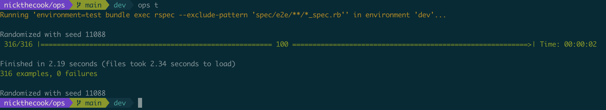
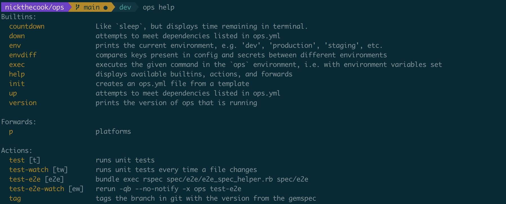

# Crystal Ops (crops)

> This is a port of [`ops`](https://github.com/nickthecook/ops) to Crystal. Versions start at 2.0.0, and the executable is still `ops`. `ops` remains available via `gem` as [`ops_team`](https://rubygems.org/gems/ops_team). See bottom of file for differences between `crops` and `ops`.

> The code in this repo is currently hot garbage, due mostly to having been ported from Ruby without significant refactoring (it's certainly not due to my being new to Crystal). The refactor is a work in progress. However, the tool works.

[](https://badge.fury.io/rb/ops_team)

[View on RubyGems.org](https://rubygems.org/gems/ops_team)

> Jump to the [installation instructions](https://github.com/nickthecook/crops#installation).

## Overview

`ops` lets you add shell commands to `ops.yml` and run them via shortcuts when you're in that directory. `ops.yml` becomes a context-aware place to add common commands.


The commands you run to work with your project become discoverable to other devs. You can have different commands in different directories, because `ops` always looks for `ops.yml` in your current working directory.



New devs don't need to find which Rakefile contains the task that failed. Just run `ops help`.



You no longer have to write a shell script for that long `curl` command that hits your API in dev, just run `ops create-event`.


`ops` will encrypt your SSH keys using a passphrase from an EJSON file, and never prompt you for the passphrase:


This passphrase and other secrets for your project can be kept in an environment-specific EJSON file, which `ops` will automatically load for you every time it runs, if you have `ejson` installed. This lets you commit the secrets safely, while only sharing EJSON keys for each environment with other developers or a CI/CD pipeline.

## Dependencies

You can record dependencies for your project in `ops.yml`:


and `ops up` will satisfy them for you.


The following dependency types are supported:

- `brew`: installs a package using [Homebrew](https://brew.sh/) if running on a Mac
- `cask`: installs a Homebrew cask if running on a Mac
- `apt`: installs a package using `apt` if running on debian-based linux
- `apk`: installs a package using `apk` if running on alpine linux
- `gem`: installs a gem
- `docker`: uses `docker-compose` to start and stop a service in a subdirectory of your project
- `custom`: runs a custom shell command
- `dir`: creates a local directory (for when your app needs a directory, but there are no checked-in files in it)
- `sshkey`: creates an SSH key at the given path, if it doesn't already exist; can be configured to encrypt the private key with a passphrase

## Config and Secrets

`ops` will try to load `config/$environment/config.json` and `config/$environment/secrets.ejson` when you run it. If these files aren't present, no problem.

> `$environment` is a variable `ops` uses to detect which environment it's running in. `ops` assumes the environment is `dev` by default, and you can `export environment=staging`, for example, to change the current environment.

If these files are present, `ops` will load every key:value pair it finds under `.environment` into environment variables.


For an [EJSON](https://github.com/Shopify/ejson) file, `ops` will first decrypt these values, then load them.

> You must have the executable `ejson` in your path to use this feature. You can install it via `gem` or by using the Shopify Homebrew tap `shopify/shopify`.


This allows you to check in most of your secrets safely, and transparently load them when running your code.

## Installation

#### Via gem

For the Crystallized version of `ops` from this repo:

```shell
brew install bdw-gc libevent libyaml pcre2
gem install ops_team -v 2.0.0.rc20
```

For the plain ol' Ruby version:

`gem install ops_team`

#### Via brew

```
brew tap nickthecook/crops
brew install ops
```

#### Via GitHub Release

There are tarballs of binaries in the [Releases](https://github.com/nickthecook/crops/releases) for this project. Just extract one, copy the binary for your platform into your `$PATH`, and run `ops version` to make sure it worked.

## Differences between `crops` and `ops`

`crops` does not support:

- the `background` builtin (`bg`)
- the `background-log` builtin (`bglog`)
- performance profiling
- the `sshkey.passphrase` option (use `ssh.passphrase_var` instead; default is `SSH_KEY_PASSPHRASE`)

The following things are different between `crops` and `ops`:

- default template dir for `ops init` is `$HOME/.ops_templates`; override with option `init.template_dir` or `OPS__INIT__TEMPLATE_DIR`

## Things that are different from `ops` but will be fixed

- "did you mean...?" suggestions

## Options

`ops` supports options to change various behaviours:

- `snap.install`
  - if `true`, `ops` will install snaps listed under `dependencies`
  - default: `true`
- `snap.use_sudo`
  - if `true`, `ops` will use `sudo` to run `snap` commands
  - default: `true`
- `gem.use_sudo`
  - if `true`, `ops` will use `sudo` to run `gem install` commands
  - default: false
- `gem.user_install`
  - if `true`, `ops` will pass the `--user-install` option to `gem install` commands
  - default: false
- `pip.command`
  - `ops` will use the value as the command to invoke `pip`
  - default: `python3 -m pip`
- `sshkey.key_size`
  - `ops` will create private SSH keys with this size
  - default: `4096`
- `sshkey.key_algo`
  - `ops` will use this value as the SSH key algorithm
  - default: `rsa`
- `sshkey.passphrase_var`
  - `ops` will use this value as the name of the environment variable to read the SSH key passphrase from
  - default: `SSH_KEY_PASSPHRASE`
- `sshkey.add_keys`
  - if `false`, `ops` will not attempt to add SSH keys it loads to the SSH agent
  - default: `true`
- `sshkey.key_lifetime`
  - `ops` will set the key lifetime of SSH keys it adds to the agent to this number of seconds
  - default: `3600` (1 hour)
- `sshkey.key_file_comment`
  - `ops` will use this value as the key comment when adding SSH keys to the SSH agent
  - this comment is visible in `ssh-add -l`, allowing you to identify which keys are loaded
  - default: `<user>@<hostname -s>`
- `apt.use_sudo`
  - if `true`, `ops` will use `sudo` to run `apt` commands when not root
  - default: `true`
- `exec.load_secrets`
  - if `true`, `ops` will load secrets before running an `ops exec` command
  - default: `false`
- `init.template_dir`
  - `ops init` will look in this directory for `ops.yml` templates
  - default: `$HOME/.ops_templates`
- `envdiff.ignored_keys`
  - `ops envdiff` will omit these keys when showing the diff between two environments' configs
  - default: empty
- `up.fail_on_error`
  - if `true`, `ops up` will exit with an error if it fails to meet any dependency
  - default: `false`
- `up.exit_on_error`
  - if `true`, `ops up` will exit immediately if it fails to meet any dependency, instead of trying to satisfy the remaining dependencies
  - default: `false`
- `config.path`
  - `ops` will look at for a JSON config file at this path
  - default: `config/$environment/config.json`
- `secrets.path`
  - `ops` will look at for an EJSON secrets file at this path
  - default: `config/$environment/secrets.json`
- `environment_aliases`
  - `ops` will duplicate the `$environment` variable to other variables
  - intended for use with languages/frameworks that use a different env var to set the environment

Options can be specified in `ops.yml` under the top-level `options:` second, or as environment variables. E.g., setting `exec.load_secrets` via `ops.yml`:

```yaml
options:
  exec:
    load_secrets: true
```

And via ENV var:

```shell
OPS__EXEC__LOAD_SECRETS=true ops exec ...
```


